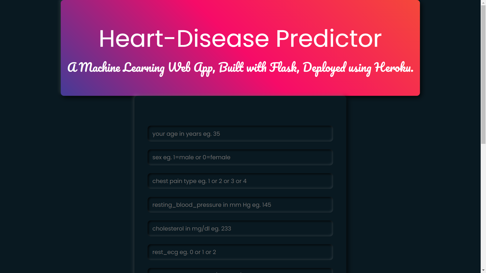
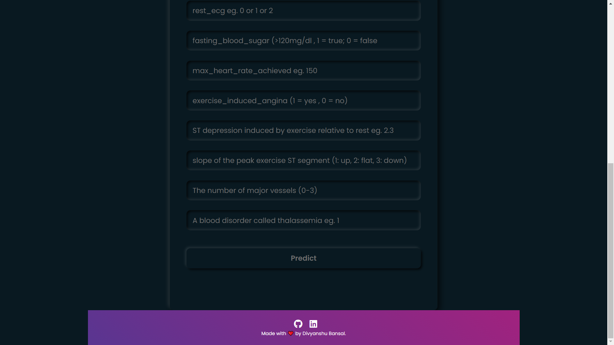
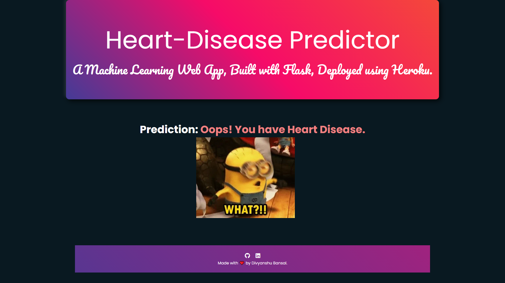

# Heart-Disease Prediction

  

• If you want to view the deployed model, click on the following link: 
Deployed at: _https://heartdiseasepredictionmodel.herokuapp.com/_

Screenshots of the website

Screenshots of the Results

Heart is an important organ in human body as it pumps the blood to the various organs present in the body of a human being. As we can see heart disease are growing at a rapid pace and its causes could be anything from heredity to lifestyle which includes bad eating habits and poor sleep pattern and most importantly stress which has become an unwanted weed in everyone’s life.

   Heart disease are becoming more common nowadays. This AI project help people to predict whether they are having any heart disease or not by knowing a bit about them through taking certain attributes as the input, following are the attributes with their normal values, so the normal values of

•	Blood pressure is 120/90
•	Cholesterol is 100-129 mg/dL
•	Pulse rate is 72
•	Fasting Blood Sugar level is 100 mg/dL
•	Heart rate is 60-100 bpm
•	ECG is normal
•	Width of major vessels is 25 mm (1 inch)

This project gives the survey about different classification techniques used for predicting the risk level of each person based on age, gender, Blood pressure, cholesterol, pulse rate.

Our project on “Heart Disease Prediction” system is particularly based on predictive modeling which predicts the disease of the user on the basis of the symptoms that user provides as an input to the system. The system analyzes the symptoms provided by the user as input and gives the probability of the disease as an output. We have used 5 different and very well known data science algorithms for Heart Disease Prediction such as Naïve Bayes, KNN, Decision Tree, Linear Regression and Random Forest Algorithms. These techniques calculate the probability of the disease.

 Therefore, average prediction accuracy probability 83% is obtained.
 

According to a survey done by World Health Organization, 12 million of deaths are taking place just because of one or other type of heart diseases also known as cardiovascular diseases.
In our project we have taken the dataset from Kaggle and after doing all the exploration and selecting training and testing datasets we used very well known algorithms which were taught to us in AI Classes like Naïve Bayes algorithm and also used some of the other machine learning algorithms as well logistic regression, random forest, decision tree and k-nearest-neighbour algorithms.
We integrated this model with our front end to make a website which will help users to predict whether they are having heart disease or not and can take certain ensures accordingly.
